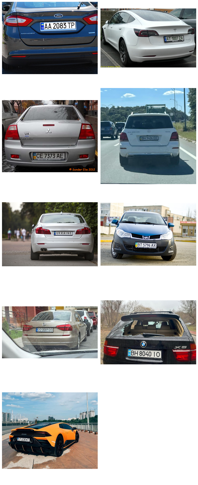
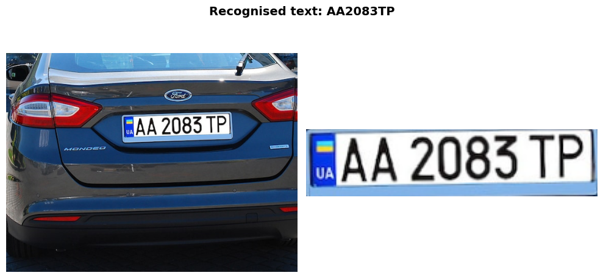
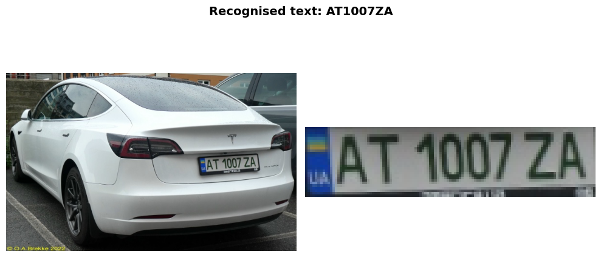
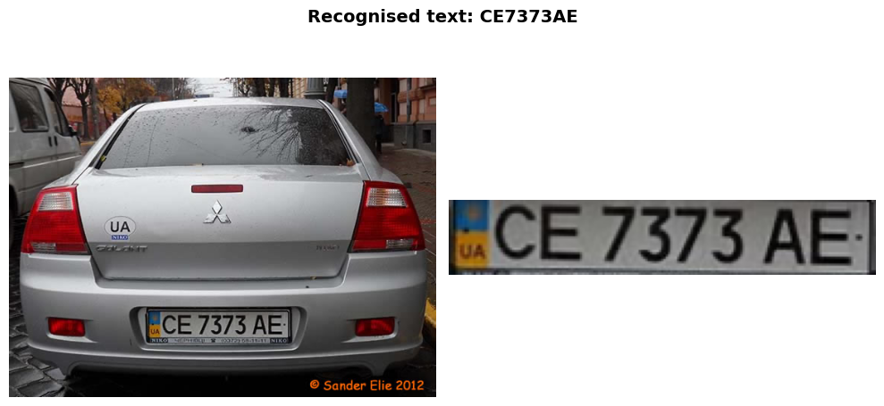
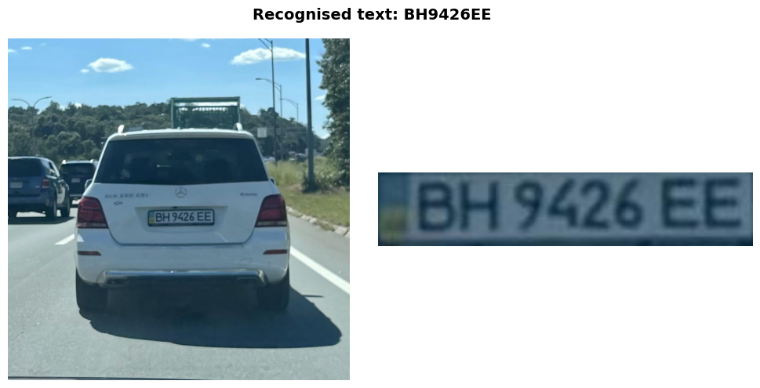
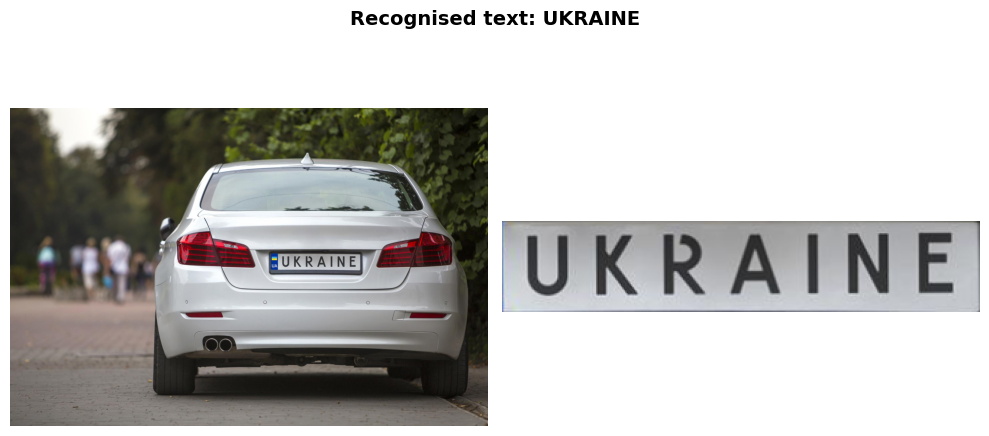
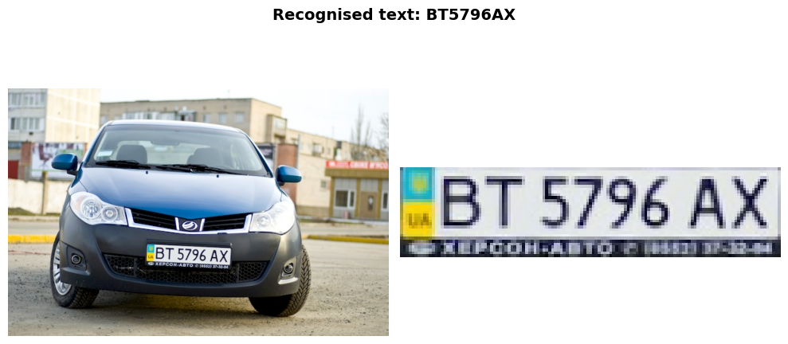
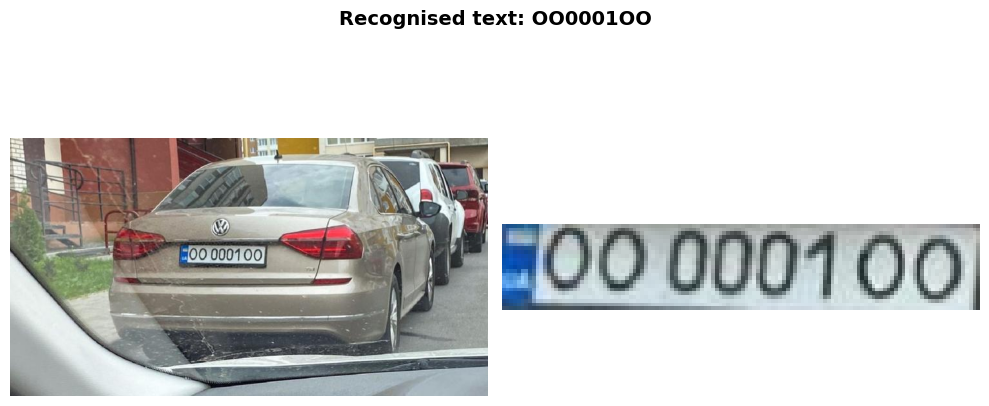
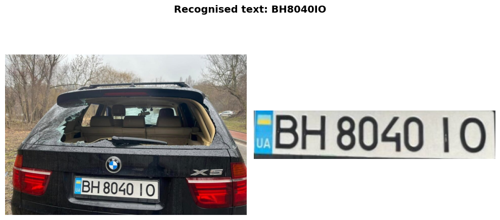

# License Plate Detection & Recognition

---

## Overview

This project implements a classical pipeline for automatic license plate detection and character recognition. The system processes images of vehicles to:

- Automatic localization of license plate regions using contour analysis and geometric filtering.
- Homography-based transformation to correct plate rotation and skew.
- Robust extraction of individual characters using adaptive thresholding and morphological operations.
- HOG feature extraction with k-Nearest Neighbors classification.
- Automated generation of character templates with realistic variations and noise.

**Constraints:** No deep learning or pretrained neural networks - only OpenCV, NumPy, and classical ML methods.

---

### Below given test images are displayed in a grid layout for comparison and analysis.

---

### 1. Preprocessing
- Grayscale conversion
- Bilateral filtering (noise reduction while preserving edges)
- Adaptive thresholding for edge enhancement

### 2. Plate Detection
- Contour detection using hierarchical retrieval
- Filtering by:
  - Aspect ratio (2.5 - 7.0)
  - Number of vertices (4-6 for rectangular shapes)
  - Character presence validation
- Perspective correction using homography

### 3. Character Segmentation
- Binary conversion using Otsu's thresholding
- Contour-based character extraction
- Filtering criteria:
  - Height: 50% - 95% of plate height
  - Aspect ratio: taller than wide
  - Median height alignment (±10% tolerance)
- Normalization to 40×40 pixels

### 4. Character Recognition
- HOG (Histogram of Oriented Gradients) feature extraction
  - Window: 40×40
  - Block: 16×16
  - Cell: 8×8
  - Bins: 9
- k-NN classification
- ASCII mapping for final text output

---

## Results

---

## Improvement Ideas

**Detection Improvements:**
- Multi-scale detection for varying plate sizes
- Color-based filtering (many plates are white/yellow)
- Edge density analysis to distinguish plates from other rectangles

**Segmentation Improvements:**
- Connected component analysis with morphological operations
- Machine learning-based character/non-character classification

**Recognition Improvements:**
- More diverse training templates (additional fonts, degradations)
- Ensemble methods combining multiple classifiers
- Post-processing with dictionary/pattern validation (e.g., regional plate formats)
- Confusion pair resolution (explicit handling of O/0, I/1)

---

## Results

 This classical pipeline successfully demonstrates license plate detection and character recognition without deep learning. All license plates were recognised correctly. Even in the hardest cases like `OO 0001 OO` all characters were recognised correctly. While limited compared to modern deep learning approaches, it showcases fundamental CV techniques including edge detection, morphological operations, geometric transformations, feature extraction, and classical machine learning.
